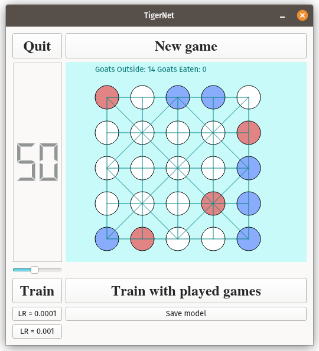

# TigerNet

A program to train a simple neural net for the Tiger player of the boad game Baghchal.

The neural net training is implemented using `PyTorch`. A simple GUI is implement to play the game using `PySide6`. Trained models can be saved as `onnx` models using [torch.onnx](https://pytorch.org/docs/stable/onnx.html) and loaded using onnx web runtime to run the models on web applications. 

## Dependencies
* [PySide6](https://wiki.qt.io/Qt_for_Python), for GUI
* [PyTorch 2.0](https://pytorch.org/), for implementing and training the Convolutional Neural Network for AI game play
* [torch.onnx](https://pytorch.org/docs/stable/onnx.html): for saving trained models in the [onnx](https://onnx.ai/) format
* [numpy](https://numpy.org/), for array and mathematical operations

## Screenshot
A screenshot of TigerNet GUI is given below. Red circles are Tiger players (which is moved by the neural net that we call TigerNet) and the blue circles Goat players which is played by a user. Initially the TigerNet has random parameters. After few rounds of training on random games (through the Train button), a noticable improvement in the TigerNet's game play can be observed.

